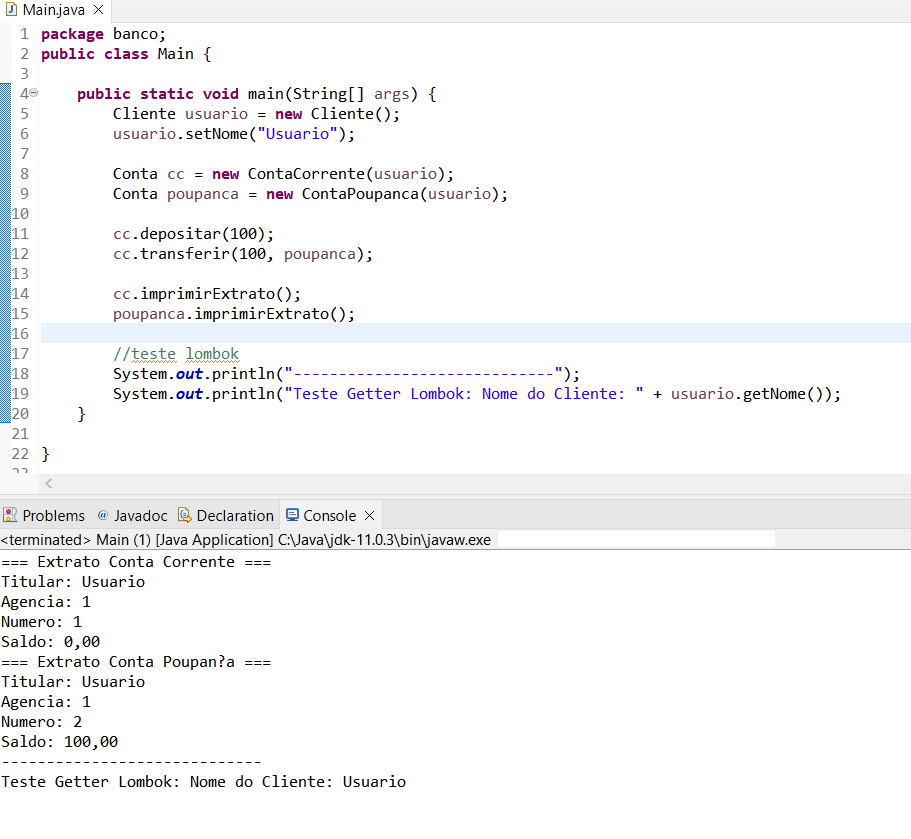
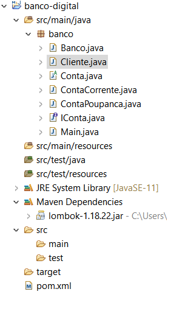

# Criando um Banco Digital com Java e Orientação a Objetos

Esta é a resolução do projeto: "Criando um Banco Digital com Java e Orientação a Objetos", referente ao Bootcamp Java da Digital Innovation One.

Em relação ao projeto original efetuei a evolução do código recomendada no final do projeto que é adicionar o Lombok para reduzir o código dos Getters e Setters.

A pasta banco é referente aos códigos construídos no projeto com as atualizações e o arquivo pom.xml corresponde ao Maven(infos, compilador e a dependência do Lombok).

## Passos efetuados

1 - Fiz a instalação do Lombok na IDE Eclipse, Java 11, seguindo as orientações presentes na página oficial: https://projectlombok.org/setup/eclipse

2 - Além disso disso adicionei o Lombok como dependencia do Maven, documentação: https://projectlombok.org/setup/maven

3 - Alterei os getters e setters do projeto original pelas features do Lombok @Getter e @Setter, documentação: https://projectlombok.org/features/GetterSetter

